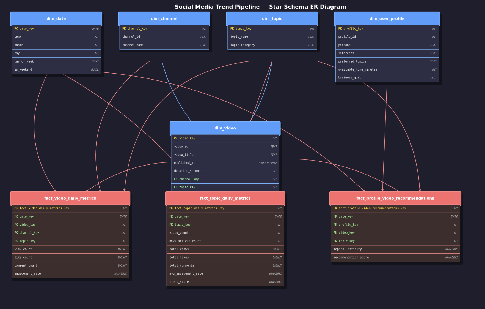
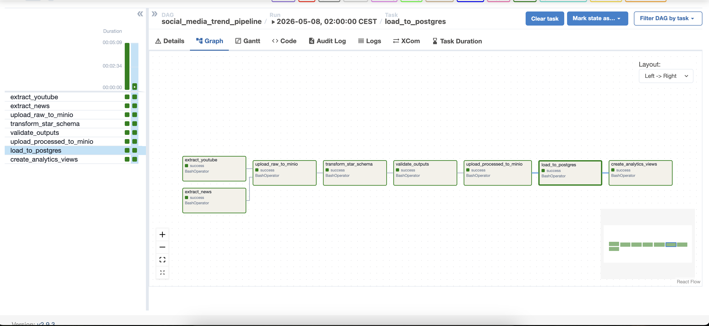

# Technikai Dokumentáció – Social Media Trend Pipeline

**Hallgató:** Katona Benedek (LNU506)

---

## 1. Architektúra és tervezési döntések

### 1.1 Áttekintés

A pipeline célja napi rendszerességgel összegyűjteni és elemzésre alkalmassá tenni a YouTube és a hírmedia által generált, közösségi-médiával kapcsolatos adatokat. A rendszer három szimulált felhasználói profil számára személyre szabott videóajánlókat és trendpontszámokat is kiszámol.

A teljes stack helyi Docker Compose-alapú környezetben fut, amely bármely gépen reprodukálhatóan elindítható. A pipeline lefedi a data engineering életciklus összes fő elemét: adatgenerálás / betöltés → landing zone → transzformáció → adattárház → kiszolgálás.

### 1.2 Komponensek és tervezési indoklás

| Komponens | Választott eszköz | Indoklás |
|---|---|---|
| Orchestration | Apache Airflow 2.9.3 | Iparági szabvány Python-alapú orkesztrációs eszköz; DAG-ok segítségével a lépések közötti függőségek és az idempotens újrafuttatás egyszerűen megvalósítható |
| Landing zone | MinIO | S3-kompatibilis objektumtároló; lokálisan futtatható, a nyers JSON és a feldolgozott CSV fájlok elkülönülten kerülnek tárolásra |
| Adattárház | PostgreSQL 15 | Megbízható relációs adatbázis; a csillag séma SQL-ben természetesen fejezhető ki; könnyen csatlakoztatható Metabase-hez |
| Transzformáció | Pandas | Könnyen olvasható, gyorsan fejleszthető Python-könyvtár batch transzformációhoz |
| BI dashboard | Metabase v0.49.10 | Nyílt forráskódú, PostgreSQL-lel azonnal összeköthető BI eszköz; a `metabase-init` konténer a Metabase REST API-ján keresztül automatikusan elvégzi a telepítési varázslót, létrehozza az adatbázis-kapcsolatot, a 4 kérdést és a dashboardot – manuális konfiguráció nélkül |
| Infrastruktúra | Docker Compose | Egyetlen paranccsal (`docker compose up --build`) elindítható, reprodukálható környezet; az összes konfiguráció verzókezelésben tárolható |

### 1.3 Adatforrások

1. **YouTube Data API v3** (REST API, strukturált JSON)
   Az API a keresési lekérdezésekre videó-azonosítókat ad vissza, amelyeket egy második kérés bővít statisztikákkal (`viewCount`, `likeCount`, `commentCount`) és metaadatokkal (`snippet`, `contentDetails`). Témakörönként külön JSON fájl készül (`data/raw/youtube/<topic>.json`). A szkript `DEMO_MODE=true` esetén szintetikus adatot generál, így API kulcs nélkül is futtatható.

2. **NewsAPI** (REST API, félig strukturált JSON)
   A napi hírkínálatból az API cikkcímeket, leírásokat és tartalmakat ad vissza. Az extrakciós szkript egész napi lekérdezési ablakban hívja az API-t, az eredmény `data/raw/news/news.json` fájlba kerül.

3. **user_profiles.csv** (statikus CSV fájl)
   A három felhasználói profil (Junior Data Engineer, ML Startup Founder, Marketing Analyst) személyre szabott metaadatokat tartalmaz: érdeklődési körök, preferált témák, rendelkezésre álló percek és üzleti cél. Ez a forrás teszi lehetővé a rekomendációs pontszám kiszámítását.

---

## 2. Adatmodell – Csillag séma

A transzformáció eredménye egy csillag séma PostgreSQL-ben, amely **3 ténytáblát** és **5 dimenziótáblát** tartalmaz.

### 2.1 Dimenziótáblák

```
dim_date
  date_key (PK, DATE)
  year, month, day
  day_of_week
  is_weekend

dim_channel
  channel_key (PK, INT)
  channel_id  (UNIQUE TEXT)
  channel_name

dim_topic
  topic_key (PK, INT)
  topic_name (UNIQUE TEXT)
  topic_category

dim_user_profile
  profile_key (PK, INT)
  profile_id  (UNIQUE INT)
  persona
  interests
  preferred_topics
  available_time_minutes
  business_goal

dim_video
  video_key (PK, INT)
  video_id   (UNIQUE TEXT)
  video_title
  published_at (TIMESTAMPTZ)
  duration_seconds
  channel_key (FK → dim_channel)
  topic_key   (FK → dim_topic)
```

### 2.2 Ténytáblák

```
fact_video_daily_metrics                  ← fő ténytábla
  fact_video_daily_metrics_key (PK)
  date_key    (FK → dim_date)
  video_key   (FK → dim_video)
  channel_key (FK → dim_channel)
  topic_key   (FK → dim_topic)
  view_count, like_count, comment_count
  engagement_rate                         ← (likes+comments)/views

fact_topic_daily_metrics                  ← aggregált témakör-metrikák
  fact_topic_daily_metrics_key (PK)
  date_key   (FK → dim_date)
  topic_key  (FK → dim_topic)
  video_count, news_article_count
  total_views, total_likes, total_comments
  avg_engagement_rate
  trend_score                             ← video_count×2 + news×3 + engagement×100

fact_profile_video_recommendations        ← személyre szabott ajánlók
  fact_profile_video_recommendations_key (PK)
  date_key    (FK → dim_date)
  profile_key (FK → dim_user_profile)
  video_key   (FK → dim_video)
  topic_key   (FK → dim_topic)
  topical_affinity
  recommendation_score                    ← 0–100 pont
```

### 2.3 ER-diagram

```
dim_date ──────────────────────────────────────────┐
                                                   │ date_key
dim_channel ──────────────────────────────────┐    │
                                              │    ▼
dim_topic ────────────────────────────────┐   │  fact_video_daily_metrics
                                          │   │    │ video_key
dim_video ────────────────────────────────┼───┘    │
  ├── channel_key (FK → dim_channel) ─────┘        │
  └── topic_key   (FK → dim_topic)  ─────┘         │
                                                   │
dim_date ──────────────────────────────────────────┤
                                                   │ date_key
dim_topic ─────────────────────────────────────────► fact_topic_daily_metrics

dim_date ──────────────────────────────────────────┤
                                                   │ date_key
dim_user_profile ──────────────────────────────────► fact_profile_video_recommendations
dim_video ─────────────────────────────────────────┘
dim_topic ─────────────────────────────────────────┘
```



### 2.4 Aggregációk és adattisztítás

A `build_star_schema.py` szkript a következő lépéseket hajtja végre:

1. **Null kezelés:** `view_count`, `like_count`, `comment_count` → 0 ha hiányzik; `topic_name` → `"unknown"` ha üres.
2. **Típuskonverzió:** ISO 8601 időbélyegek → `datetime` objektumok UTC timezone-nal; YouTube ISO 8601 duration (`PT12M30S`) → egész másodpercek.
3. **Engagement rate:** `(likes + comments) / views` per videó; nulla osztó esetén 0.0.
4. **Hírszámolás:** Az NewsAPI cikkek szövegéből megszámoljuk, hány cikk tartalmazza az adott témakör kulcsszavait (case-insensitive egyezés).
5. **Trend score:** `video_count × 2 + news_article_count × 3 + avg_engagement_rate × 100` – a három komponens ötvözi a videós és híres aktivitást, súlyozva a valós interakciók arányát.
6. **Rekomendációs pontszám:** Témabeli affinitás (45%), kulcsszó-egyezés (15%), időilleszkedés (15%), népszerűség (15%), engagement (10%) – 0–100 skálán normalizálva.

---

## 3. Pipeline futása és eredmény

### 3.1 Airflow DAG

A `social_media_trend_pipeline` DAG napi ütemezéssel (`@daily`) fut, `catchup=False` beállítással. Az összes task `BashOperator`-ral hívja meg a Python szkripteket.

**Taskok sorrendje és függőségei:**

```
extract_youtube ──┐
                  ├──► upload_raw_to_minio ──► transform_star_schema
extract_news ─────┘         ──► validate_outputs ──► upload_processed_to_minio
                                    ──► load_to_postgres ──► create_analytics_views
```



**Idempotencia:** A `load_to_postgres.py` az összes ténytáblát és dimenziótáblát `TRUNCATE … RESTART IDENTITY CASCADE` utasítással üríti a betöltés előtt, így a DAG újrafuttatva mindig ugyanazt az állapotot produkálja.

### 3.2 Minőségellenőrzés

A `validate_pipeline_outputs.py` a következőket ellenőrzi:
- Minden szükséges feldolgozott CSV fájl létezik és nem üres.
- Egyediségi kényszerek: minden dimenzió- és ténytábla elsődleges kulcsa egyedi.
- Nem negatív metrikák: nézettség, engagement, trend score ≥ 0.
- Referenciális integritás: idegenkulcs-hivatkozások teljessége (`date_key`, `video_key`, `channel_key`, `topic_key`, `profile_key`).

### 3.3 Mintaeredmény (demo módban)

Demo módban (`DEMO_MODE=true`) 3 téma × 2 videó = 6 szintetikus videórekord és 5 hír kerül betöltésre.

**Mintakimenet – `vw_topic_trends`:**

```
date_key   | topic_name              | video_count | news_article_count | trend_score | rank
-----------+-------------------------+-------------+--------------------+-------------+-----
2026-05-16 | artificial intelligence |           2 |                  2 |      10.12  |    1
2026-05-16 | data engineering        |           2 |                  3 |      10.08  |    2
2026-05-16 | python                  |           2 |                  2 |       9.45  |    3
```

**Mintakimenet – `vw_profile_recommendations` (Top-3 per persona):**

```
persona              | topic_name              | video_title                              | score | rank
---------------------+-------------------------+------------------------------------------+-------+-----
Junior Data Engineer | data engineering        | Demo: Introduction to Data Engineering   | 82.5  |    1
Marketing Analyst    | python                  | Demo: Introduction to Python             | 74.0  |    1
ML Startup Founder   | artificial intelligence | Demo: Advanced Artificial Intelligence   | 91.2  |    1
```

### 3.4 SQL nézetek és analitikai lekérdezések

Az alábbi négy view jön létre automatikusan a `create_analytics_views` task során:

| View neve | Leírás |
|---|---|
| `vw_topic_trends` | Napi témakör-trendek, rangsorolva trend score szerint |
| `vw_top_videos` | Napi legtöbbet nézett videók, csatorna- és témakör-metaadatokkal |
| `vw_profile_recommendations` | Személyre szabott videóajánlók profilonként |
| `vw_daily_pipeline_summary` | Napi pipeline-összesítő (videók, csatornák, nézettség) |

**1. lekérdezés – Napi toplistás témakörök:**
```sql
SELECT topic_name, video_count, news_article_count,
       ROUND(avg_engagement_rate::numeric, 4) AS avg_engagement,
       trend_score, daily_topic_rank
FROM vw_topic_trends
WHERE date_key = CURRENT_DATE
ORDER BY daily_topic_rank;
```

**2. lekérdezés – Legjobb engagement-arányú videók (elmúlt 7 nap):**
```sql
SELECT date_key, topic_name, channel_name, video_title,
       view_count, ROUND(engagement_rate::numeric, 4) AS engagement_rate
FROM vw_top_videos
WHERE date_key >= CURRENT_DATE - INTERVAL '7 days'
ORDER BY engagement_rate DESC
LIMIT 10;
```

**3. lekérdezés – Személyre szabott top-3 ajánló profilonként:**
```sql
SELECT persona, topic_name, video_title, duration_seconds,
       ROUND(recommendation_score::numeric, 1) AS score, recommendation_rank
FROM vw_profile_recommendations
WHERE date_key = CURRENT_DATE AND recommendation_rank <= 3
ORDER BY persona, recommendation_rank;
```

---

## 4. Adatkiszolgálás – Metabase dashboard

A Metabase dashboard automatikusan jön létre a `metabase-init` konténer által (`scripts/setup/metabase_setup.py`), amely a Metabase REST API-ján keresztül:
1. Elvégzi az első indulási varázslót (admin felhasználó létrehozása).
2. Hozzáadja a PostgreSQL adatbázis-kapcsolatot.
3. Létrehozza a 4 előre konfigurált kérdést (bar chart, line chart, table).
4. Összeállítja a **Social Media Analytics** dashboardot 2×2-es elrendezésben.

A szkript idempotens: névegyezés alapján kihagyja azokat az elemeket, amelyek már léteznek.

---

## 5. Reprodukálhatóság

Az infrastruktúra teljes egészében Docker Compose-ban van definiálva (8 service):

| Service | Szerepe |
|---|---|
| `postgres` | PostgreSQL 15 adatbázis, DDL automatikus init |
| `minio` | S3-kompatibilis objektumtároló |
| `minio-create-bucket` | Init konténer: `raw` és `processed` vödrök létrehozása |
| `airflow-init` | DB migráció + admin user létrehozása |
| `airflow-webserver` | Airflow UI (port 8080) |
| `airflow-scheduler` | DAG ütemező |
| `metabase` | BI dashboard (port 3000) |
| `metabase-init` | Automatikus Metabase konfiguráció REST API-n keresztül |

**Telepítési lépések:**
```bash
git clone <repo_url>
cd data-engineering-a-gyakorlatban-hf
cp .env.example .env
# .env szerkesztése (API kulcsok VAGY DEMO_MODE=true)
docker compose up --build -d
```

**Konfiguráció:** Minden érzékeny adat `.env` fájlban van (gitignore-ban), a `.env.example` a teljes sablont tartalmazza. Hardcoded érték nincs a kódbázisban.
